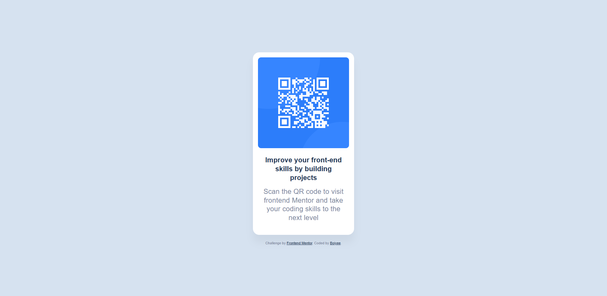

# Frontend Mentor - QR code component solution

This is a solution to the [QR code component challenge on Frontend Mentor](https://www.frontendmentor.io/challenges/qr-code-component-iux_sIO_H). Frontend Mentor challenges help you improve your coding skills by building realistic projects. 

## Table of contents

- [Overview](#overview)
  - [Screenshot](#screenshot)
  - [Links](#links)
- [My process](#my-process)
  - [Built with](#built-with)
  - [What I learned](#what-i-learned)
  - [Continued development](#continued-development)
  - [Useful resources](#useful-resources)
- [Author](#author)
- [Acknowledgments](#acknowledgments)

## Overview

### Screenshot



### Links

- Solution URL: [Solution URL](https://github.com/Boiyee/qr-code)
- Live Site URL: [Live URL]( https://boiyee.github.io/qr-code/)

## My process

### Built with

- Semantic HTML5 markup
- CSS custom properties
- Flexbox
- CSS Grid

### What I learned

```html
<div>proud of this element</div>
```
```css
:root {
  --font-family: 'Outfit', sans-serif;
  --font-weight-normal: 400;
  --font-weight-bold: 700;
  --border-radius: 20px;
  --box-shadow: 0 25px 25px rgba(0, 0, 0, 0.0477);
}
```

### Continued development

**I would love to focus more on Frontend Development for now**

### Useful resources

- [Resource 1](https://github.com/Boiyee/Calculator) - This helped me with some of my css codes. I really liked this pattern and will use it going forward. I'd recommend it to anyone still learning frontend development.
- [Resource 2](https://github.com/Boiyee/Git_mastery) - This is an amazing approach when i was trying to understand more on git.

## Author

- Website - [Boiyee](https://www.github.com/Boiyee)
- Frontend Mentor - [@Boiyee](https://www.frontendmentor.io/profile/Boiyee)
- Twitter - [Boiyee](https://www.x.com/OduwaleJubreel)

## Acknowledgments

I was inspired by some of my past projects which helped me greatly in fulfilling this challenge. Also a big thanks to adeturkey(https://github.com/adeturkey).
